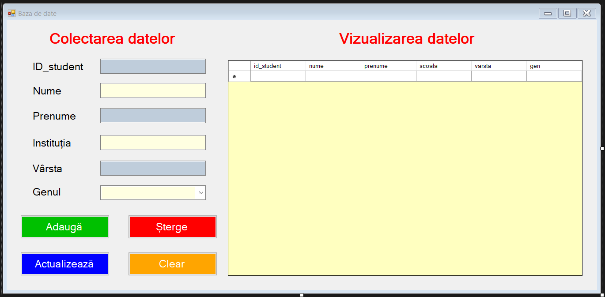
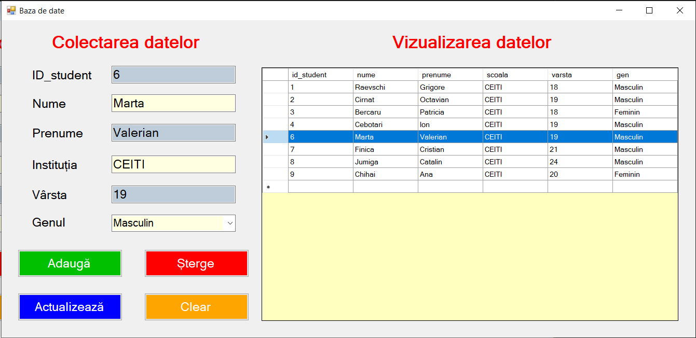

# C# Desktop Application
#### It's my first work with database (SQL server) and C# visual

<h2>How it look?<h2>



<h2>What I create ?</h2>
A simple Desktp Aplication where u can : 
<ol>
    <li>Add
    <li>Update
    <li>Delete
</ol>

<h2>How I create databse ?</h2>
```sql
create table Studenti(
	Student_ID int primary key identity not null,
	Nume varchar(20) not null,
	Prenume varchar(20) not null,
	Studii varchar(20) not null,
	Varsta varchar(20) not null,
	Genul varchar(10) not null
);
```